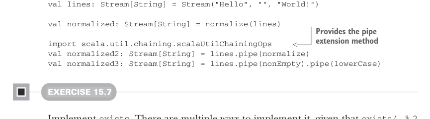

# Страница 0451
[<- Страница 0450](./page-0450) | [Индекс страниц](./) | [Страница 0452 ->](./page-0452)

> Часть 4: Эффекты и I/O / Глава 15: Обработка стримов и инкрементальный I/O / 15.2 Простые трансформации стримов / 15.2.2 Композиция трансформаций стримов

`Pipe[I, O]` — это чистый type alias для функции, которая жрёт стрим входных значений типа `I` и срет стрим выходных типа `O`. Заметьте, `Pipe` выразительности не добавляет — просто алиас для функции, и всё. А нахуя имя лепить? Чтобы юзеры нашей стрим-библиотеки перестроили мозги на независимые трансформации стримов, как нормальные FP-шники. Гляньте на примеры, пацаны:

```scala
val nonEmpty: Pipe[String, String] =
_.filter(_.nonEmpty)
val lowerCase: Pipe[String, String] =
_.map(_.toLowerCase)
```

Пайп `nonEmpty` превращает `Stream[String]` в `Stream[String]`, выметая все пустые строки нахуй, а `lowerCase` каждый входной строкой в нижний регистр переводит. В обоих кейсах основную грязную работу тянут высокоуровневые комбинаторы стримов (`filter` и `map` соответственно). Вытащив эти операции в отдельные значения, мы их независимо описываем, как модульные лего-кирпичики. Плюс, компонуем их через композицию функций — классика жанра:

```scala
val normalize: Pipe[String, String] =
nonEmpty andThen lowerCase
```

Тут мы встроенной `andThen` на функциях Scala лепим две трансформации в один высокоуровневый пайп. Раз `Pipe` — алиас для функции, пайпы на стримы навешиваем прямым вызовом. Или юзаем утилиту `scala.util.chaining.pipe`, чтоб писать `f(a)` как `a.pipe(f)` — короче и чище. Всё это эквивалентно, как разные пути к одному пиву после код-ревью:



```scala
val lines: Stream[String] = Stream("Hello", "", "World!")
val normalized: Stream[String] = normalize(lines)
```

> Обеспечивает метод расширения `pipe`

```scala
import scala.util.chaining.scalaUtilChainingOps
val normalized2: Stream[String] = lines.pipe(normalize)
val normalized3: Stream[String] = lines.pipe(nonEmpty).pipe(lowerCase)
```

#### УПРАЖНЕНИЕ 15.7

Затопи `exists`. Вариантов реализации — как багов в legacy-коде, потому что `exists(_ % 2 == 0)(Stream(1, 3, 5, 6, 7))` может нагадить либо `Stream(true)` (халтит и только финал выдаёт), либо `Stream(false, false, false, true)` (халтит, но все промежуточные вываливает), либо `Stream(false, false, false, true, true)` (не халтит вообще, все промежуточные на поток):

```scala
def exists[I](f: I => Boolean): Pipe[I, Boolean]
```

[<- Страница 0450](./page-0450) | [Индекс страниц](./) | [Страница 0452 ->](./page-0452)
