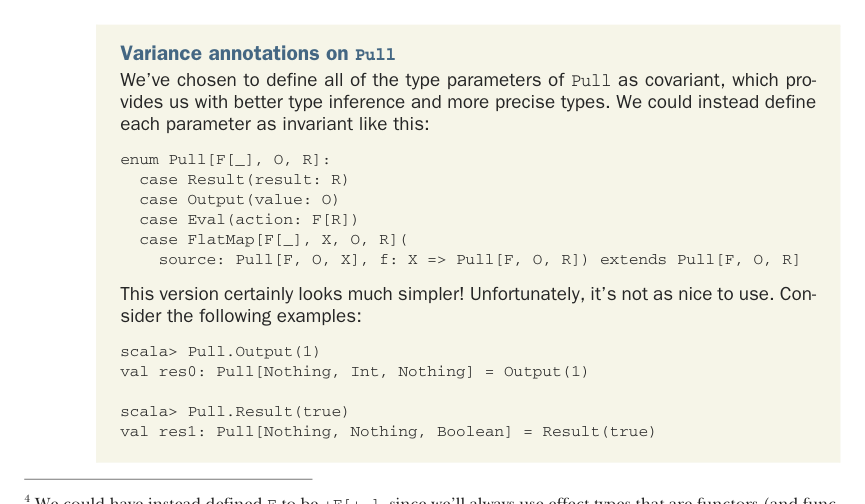

# Страница 0453
[<- Страница 0452](./page-0452) | [Индекс страниц](./) | [Страница 0454 ->](./page-0454)

> Часть 4: Эффекты и I/O / Глава 15: Обработка стримов и инкрементальный I/O / 15.3 Расширяемые pull'ы и стримы

### 15.3 Расширяемые pull'ы и стримы

Наши типы `Pull` и `Stream` — это альтернатива для описания ленивых вычислений, но по выразительности они не переплюнут `LazyList`, факт. Короче, наш файл-конвертер мы могли б накодить похожим образом, объявив `Pipe[I, O]` просто алиасом для `LazyList[I] => LazyList[O]`. Вместо того чтоб сидеть на монолитном `IO`-враппере, который эффектный исток стрима прячет под ковром, как грязное бельё, давайте апгрейдим дефинишн `Pull` и `Stream`, чтоб они жрали произвольные эффекты на завтрак. Параметризуем оба с возможностью евальнуть эффект и выдать либо результат, либо аутпут — как универсальный нож швейцарский для FP-кухни. Для этого впилим в `Pull` новый дата-конструктор:

```scala
enum Pull[+F[_], +O, +R]:
case Result[+R](result: R) extends Pull[Nothing, Nothing, R]
case Output[+O](value: O) extends Pull[Nothing, O, Unit]
case Eval[+F[_], R](action: F[R]) extends Pull[F, Nothing, R]
case FlatMap[+F[_], X, +O, +R](
source: Pull[F, O, X], f: X => Pull[F, O, R]) extends Pull[F, O, R]
```

Мы добавили свеженький `Eval`, который оборачивает экшн типа `F[R]`. `Eval[F, R]` расширяет `Pull[F, Nothing, R]`, намекая, что он не генерит аутпут (и потому влезет куда угодно, где нужен `Pull[F, O, R]`). Плюс впихнули тип-параметр `+F[_]` в `Pull`. Ковариантный, сука, чтоб `Result` и `Output` могли фиксить эффект на `Nothing` — мол, эффектов мы не трогаем, чистые мальчики.⁴



Аннотации ковариантности на `Pull` Мы все параметры `Pull` сделали ковариантными — тип-инференс чётче, типы поточнее, как после хорошего код-ревью. Могли б и инвариантными оставить, вот так:

```scala
enum Pull[F[_], O, R]:
case Result(result: R)
case Output(value: O)
case Eval(action: F[R])
case FlatMap[F[_], X, O, R](
source: Pull[F, O, X], f: X => Pull[F, O, R]) extends Pull[F, O, R]
```

Эта версия выглядит проще, блядь, как код джуна! Но юзать — пиздец, неудобно. Взгляньте на примеры, сами поймёте, где собака зарыта:

```scala
scala> Pull.Output(1)
val res0: Pull[Nothing, Int, Nothing] = Output(1)
scala> Pull.Result(true)
val res1: Pull[Nothing, Nothing, Boolean] = Result(true)
```

⁴ Могли б `F` определить как `+F[+_]`, раз уж всегда юзаем функторы (а они ковариантны по жизни). Это упростило б методы, но заставило б эффект-типы быть ковариантными в своём параметре. На деле `IO` и прочие редко так коварят, так что выбрали `+F[_]` — проверено в проде, не подведёт.

[<- Страница 0452](./page-0452) | [Индекс страниц](./) | [Страница 0454 ->](./page-0454)
