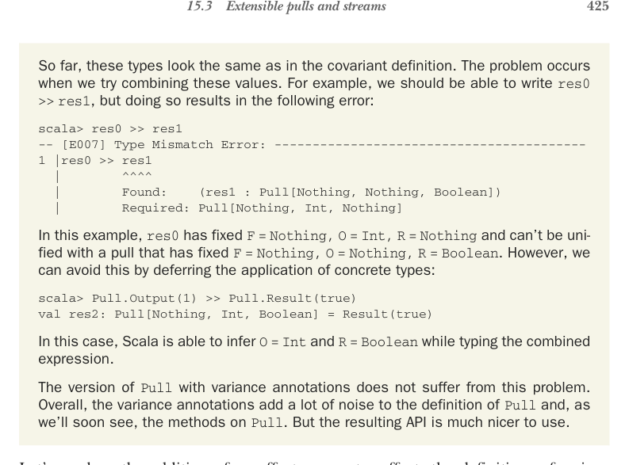
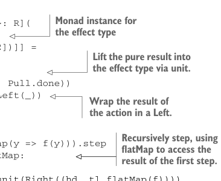

# Страница 0454

[<- Страница 0453](./page-0453) | [Индекс страниц](./) | [Страница 0455 ->](./page-0455)

> Часть 4: Эффекты и I/O / Глава 15: Обработка стримов и инкрементальный I/O / 15.3 Расширяемые pull'ы (Pulls) и стримы



## 425 15.3 Расширяемые pull'ы (Pulls) и стримы

Пока что эти типы выглядят в точности как в ковариантном варианте — ни хуя не изменилось. 
Пиздец начинается, когда пытаемся их склеивать. 
Например, должны же мочь `res0 >> res1` написать, а Scala выдаёт такую хуйню:

```scala
scala> res0 >> res1
-- [E007] Type Mismatch Error: -----------------------------------------
1 |res0 >> res1
|
^^^^
|
Found:
(res1 : Pull[Nothing, Nothing, Boolean])
|
Required: Pull[Nothing, Int, Nothing]
```

Тут `res0` уже зафиксировал `F = Nothing, O = Int, R = Nothing` и отказывается унифицироваться с pull'ом, где `F = Nothing, O = Nothing, R = Boolean`. 
Но эту херню легко обойти, если отложить подстановку конкретики:

```scala
scala> Pull.Output(1) >> Pull.Result(true)
val res2: Pull[Nothing, Int, Boolean] = Result(true)
```

Scala тут чётко выводит `O = Int` и `R = Boolean` при типизации всей комбинации — магия инференса в деле.

Версия `Pull` с аннотациями вариативности от этой хуйни не страдает. 
В общем, эти аннотации добавляют тонну шума в определение `Pull` и, как скоро увидим, в его методы. 
Но API в итоге — чистый кайф, без подвохов.

Давайте глянем, как параметр эффекта `F` ломает (или улучшает) операции на `Pull`. 
Начнём со `step`: раньше возвращал `Either[R, (O, Pull[O, R])]`. 
Теперь тип надо доработать под случай с `Eval`-нодой. 
Маппим по `F[R]`, превращаем в `Either`, кидая `R` влево. 
Выходит, `step` теперь отдаёт `F[Either[R, (O, Pull[O, R])]]`. 
Из-за этого рекурсивный `step` приходится цеплять через `flatMap`. 
А как `map` и `flatMap` на абстрактном `F` юзать? Легко — требуем `Monad[F]`:



> Монад-инстанс (Monad instance) для типа эффекта

```scala
def step[F2[x] >: F[x], O2 >: O, R2 >: R](
  using F: Monad[F2]
): F2[Either[R2, (O2, Pull[F2, O2, R2])]] =
  this match
    case Result(r) => F.unit(Left(r))
    case Output(o) => F.unit(Right(o, Pull.done))
    case Eval(action) => action.map(Left(_))
    case FlatMap(source, f) =>
      source match
        case FlatMap(s2, g) =>
          s2.flatMap(x => g(x).flatMap(y => f(y))).step
        case other =>
          other.step.flatMap:
            case Left(r) => f(r).step
            case Right((hd, tl)) => F.unit(Right((hd, tl.flatMap(f))))
```

> Поднимаем чистый результат в эффект через `unit` (единицу монады).

> Оборачиваем результат экшена в `Left`.

> Рекурсивно степпим, цепляя `flatMap` за результат первого степа.

[<- Страница 0453](./page-0453) | [Индекс страниц](./) | [Страница 0455 ->](./page-0455)
