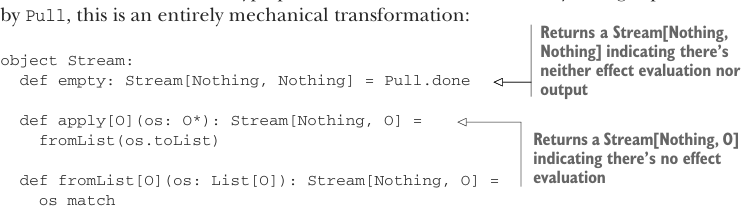

# Страница 0457

[<- Страница 0456](./page-0456) | [Индекс страниц](./) | [Страница 0458 ->](./page-0458)

> Часть 4: Эффекты и ввод-вывод (I/O) / Глава 15: Обработка потоков и инкрементальный ввод-вывод (I/O) / 15.3 Расширяемые pull'ы (pulls) и потоки

Когда в реализации `step` вылазит узел `Uncons`, мы пинаем исходный pull, чтоб он шагнул, и заворачиваем его результат в `Left` — как в матрёшку, чтоб эффект не вытек. Для этого нужен инстанс `Monad[F2]`, и благо в `step` он уже болтается в скоупе, не надо импортить заново. Остальные операции на `Pull` портируются в эффектную версию почти без гемора — чаще всего просто тип-параметр для F подкинуть, и поехало. Код главы покажет кучу примеров.<sup>5</sup> А чё с `Stream` и `Pipe`, спрашиваешь? Типа, как в том меме про "а теперь добавь монаду"?

```scala
opaque type Stream[+F[_], +O] = Pull[F, O, Unit]
```

Как и `Pull`, `Stream` подхватывает новый ковариантный тип-параметр для эффекта — F[+_], чтоб поток мог быть ленивым, но с побочками. Все конструкторы и методы для `Stream` приходится подкрутить под этот лишний параметр, но поскольку всю тяжёлую артиллерию тянет `Pull`, это чисто механическая хуйня, как рефакторинг в IDE с Alt+Enter:



> Возвращает Stream[Nothing, Nothing], сигнализируя: ни эффектов не оценивается, ни вывода нет — полный ноль, как пустой репозиторий на понедельник

```scala
object Stream:
def empty: Stream[Nothing, Nothing] = Pull.done
def apply[O](os: O*): Stream[Nothing, O] =
fromList(os.toList)
```

> Возвращает Stream[Nothing, O], мол, эффектов нет, только чистый вывод — как FP-идеалист без реала

```scala
def fromList[O](os: List[O]): Stream[Nothing, O] =
os match
case Nil => Pull.done
case hd :: tl => Pull.Output(hd) >> fromList(tl)
extension [F[_], O](self: Stream[F, O])
def toPull: Pull[F, O, Unit] = self
```


> Теперь тип возврата — F[A], эффект в кармане

```scala
def fold[A](
init: A)(f: (A, O) => A)(using Monad[F]): F[A] =
self.fold(init)(f).map(_(1))
```

> Теперь тип возврата — F[List[O]], батчинг с эффектом, чтоб не дёргать по одному

```scala
def toList(using Monad[F]): F[List[O]] =
self.toList
```

Как `fold` и `toList` на `Pull`, так и их аналоги на `Stream` теперь возвращают эффектные действия — типа, "выходи из алгебры в реальный мир". Говорим, что `fold` и `toList` — это *элиминаторы* (eliminators) для типа `Stream`: интерпретируют или компилируют алгебру потоков в целевую монаду, как компилятор из абстракций в бинарник. Можно ли юзать эти элиминаторы с неэффектными потоками? Ага, но криво, как запускать Haskell на JVM без Graal. Приходится монадный инстанс вручную пихать:

> repeat и take делегируют своим Pull-аналогам. Полные дефы — в коде главы.

```scala
scala> val x = Stream(1, 2, 3).
repeat.
take(5).
toList(using Monad.tailrecMonad).
result
val x: List[Int] = List(1, 2, 3, 1, 2)
```

<sup>5</sup> Код главы обычно определяет операции на `Stream` вместо `Pull`, если операция полезна при сборке рекурсивных pulls — чтоб не плодить сущностей, как в OO-кошмаре.

[<- Страница 0456](./page-0456) | [Индекс страниц](./) | [Страница 0458 ->](./page-0458)
