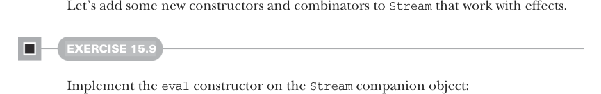
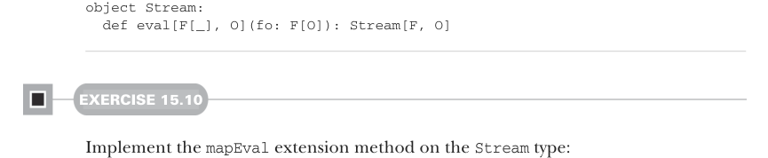
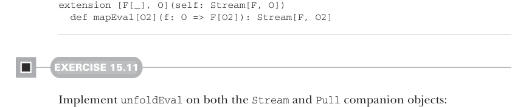

# Страница 0458

[<- Страница 0457](./page-0457) | [Указатель страниц](./) | [Страница 0459 ->](./page-0459)

> Часть 4: Эффекты и I/O / Глава 15: Обработка стримов и инкрементальный I/O / 15.3 Расширяемые пулы и стримы

## 429 15.3 Расширяемые пулы и стримы

В этом примере мы впихнули монаду `TailRec`, так что вся стрим-машина стек-сейфовая (stack-safe), как танк в окопе — не переполнится, блядь. Но приходится тащить инстанс монады явно (или тип асайн как `Stream[TailRec, Int]`), а потом запускать трамполин через `result` на результате `toList`. Чтобы не ебаться с этой бюрократией, давай замутим неэффектные версии каждого элиминатора:

```scala
extension [O](self: Stream[Nothing, O])
def fold[A](init: A)(f: (A, O) => A): A =
self.fold(init)(f)(using Monad.tailrecMonad).result(1)
def toList: List[O] =
self.toList(using Monad.tailrecMonad).result
scala> val s = Stream(1, 2, 3).repeat.take(5)
val s: Stream[Nothing, Int] = ...
```


> Вызов `toList` при `F = Nothing` рождает `List[O]`, чистый список, без соплей.

```scala
scala> val x = s.toList
val x: List[Int] = List(1, 2, 3, 1, 2)
```

> А `toList` при `F = IO` выплёвывает `IO[List[O]]`, чтоб не расслаблялись.

```scala
scala> val y = (s: Stream[IO, Int]).toList
val y: IO[List[Int]] = ...
```



Давай добавим новые конструкторы и комбинаторы к `Stream`, которые дружат с эффектами, — чтоб стрим не был как девственник в баре.

#### УПРАЖНЕНИЕ 15.9

Замути конструктор `eval` в компаньоне `Stream`:



```scala
object Stream:
def eval[F[_], O](fo: F[O]): Stream[F, O]
```

#### УПРАЖНЕНИЕ 15.10

Замути extension-метод `mapEval` на типе `Stream`:



```scala
extension [F[_], O](self: Stream[F, O])
def mapEval[O2](f: O => F[O2]): Stream[F, O2]
```

#### УПРАЖНЕНИЕ 15.11

Замути `unfoldEval` и в компаньонах `Stream`, и `Pull`:

```scala
object Stream:
def unfoldEval[F[_], O, R](
init: R)(f: R => F[Option[(O, R)]]): Stream[F, O]
```

[<- Страница 0457](./page-0457) | [Указатель страниц](./) | [Страница 0459 ->](./page-0459)
