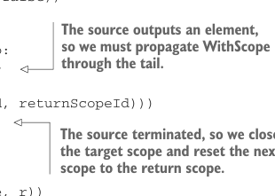

```yaml
---
title: "Страница 0469"
outline: false
---
```

# Страница 0469

[<- Страница 0468](./page-0468) | [Индекс страниц](./) | [Страница 0470 ->](./page-0470)

> Часть 4: Эффекты и I/O / Глава 15: Обработка стримов и инкрементальный I/O / 15.3 Расширяемые пулы и стримы / 15.3.3 Обеспечение безопасности ресурсов

исходный стрим (source stream) через этот новорождённый подскоп. Как только кончится — откатываемся к оригинальному скопу:

```scala
case OpenScope(source, finalizer) =>
scope.open(finalizer.getOrElse(F.unit(()))).flatMap(subscope =>
WithScope(source, subscope.id, scope.id).step(subscope))
```

Изменить `step` под `WithScope` — это уже не пальцем тыкать. Сначала роемся в древе скопов, как в семейном древе, ищем цель. Потом шаг по source-стриму в этом скопе. Если прилетит `Done` — целевой скоп на хуй, ищем родительский для возврата. А иначе `WithScope` проталкиваем через остаток стрима в `Out`:

```scala
case WithScope(source, scopeId, returnScopeId) =>
scope.findScope(scopeId)
.map(_.map(_ -> true).getOrElse(scope -> false))
.flatMap:
case (newScope, closeAfterUse) =>
source.step(newScope).attempt.flatMap:
case Success(Out(scope, hd, tl)) =>
F.unit(Out(scope, hd,
WithScope(tl, scopeId, returnScopeId)))
case Success(Done(outScope, r)) =>
scope.findScope(returnScopeId)
.map(_.getOrElse(outScope))
.flatMap: nextScope =>
scope.close.as(Done(nextScope, r))
case Failure(t) =>
```



> Источник выдал элемент, так что `WithScope` надо протащить через хвост.


> При шаге пиздец прилетел — целевой скоп закрываем и ошибку перекидываем дальше.

> Источник откинулся — целевой скоп на помойку, следующий сбрасываем на скоп возврата.

```scala
scope.close.flatMap(_ => F.raiseError(t))
```

С этими правками `resource` лепим на `Eval` и `OpenScope`:

```scala
def resource[F[_], R](acquire: F[R])(release: R => F[Unit]): Stream[F, R] =
Pull.Eval(acquire).flatMap(r =>
Pull.OpenScope(Pull.Output(r), Some(release(r))))
```

Эта имплементация держит и когда продюсер выдохся, и когда ненормальный пиздец. Но для раннего конца ещё один трюк нужен: если хвост стрима можно на свалку — всегда в свежем скопе. Иначе ресурсы в подскопах не закроются вовремя, и утечки как в старом Java. Добавляем метод `scope` к `Stream`, чтоб новый скопик открывал, и лепим такие на все операции (ops), что стримы по кускам жрут — типа `take`, `takeWhile` и прочие:

```scala
def scope: Stream[F, O] =
Pull.OpenScope(self, None)
def take(n: Int): Stream[F, O] =
self.take(n).void.scope
```

[<- Страница 0468](./page-0468) | [Индекс страниц](./) | [Страница 0470 ->](./page-0470)
