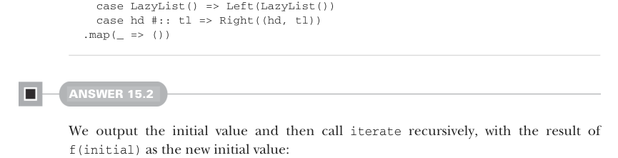

# Страница 0474

[<- Страница 0473](./page-0473) | [Указатель страниц](./) | [Страница 0475 ->](./page-0475)

> Часть 4: Эффекты и I/O / Глава 15: Обработка потоков и инкрементальный I/O / 15.6 Ответы на упражнения

## 445 15.6 Ответы на упражнения



```scala
case LazyList() => Left(LazyList())
case hd #:: tl => Right((hd, tl))
.map(_ => ())
```

#### ОТВЕТ 15.2

Сначала вываливаем начальное значение, а потом рекурсивно дёргаем `iterate`, подсовывая результат `f(initial)` как новое начальное — классика, как бесконечный цикл с мутацией, только чисто и без слёз по утрам:


```scala
def iterate[O](initial: O)(f: O => O): Pull[O, Nothing] =
Output(initial) >> iterate(f(initial))(f)
```

#### ОТВЕТ 15.3

`drop` лепим рекурсивной функцией, которая откусывает по одному элементу (uncons) и рекурсит, пока счётчик дропа не скатится до нуля — как резал бы лаги из лога, пока не надоест:

```scala
def drop(n: Int): Pull[O, R] =
if n <= 0 then this
else uncons.flatMap:
case Left(r) => Result(r)
case Right((_, tl)) => tl.drop(n - 1)
```

`takeWhile` похож: сначала uncons элемент, потом думаем, рекурсить ли. Если элемент прошёл предикат — вываливаем его и дёргаем `takeWhile` на хвосте. Нет — возвращаем этот элемент вперёд хвоста как плод pull. А если источник на нуле — сливаем накопленное и валим, без драм:

```scala
def takeWhile(f: O => Boolean): Pull[O, Pull[O, R]] =
uncons.flatMap:
case Left(r) => Result(Result(r))
case Right((hd, tl)) =>
if f(hd) then Output(hd) >> tl.takeWhile(f)
else Result(Output(hd) >> tl)
```

`dropWhile` — это `takeWhile`, только без вываливания элементов, что прошли предикат: фильтруем на лету, как просеиваешь спам в почте, и не засоряешь трубу:

```scala
def dropWhile(f: O => Boolean): Pull[Nothing, Pull[O, R]] =
uncons.flatMap:
case Left(r) => Result(Result(r))
case Right((hd, tl)) =>
if f(hd) then tl.dropWhile(f)
else Result(Output(hd) >> tl)
```

[<- Страница 0473](./page-0473) | [Указатель страниц](./) | [Страница 0475 ->](./page-0475)
