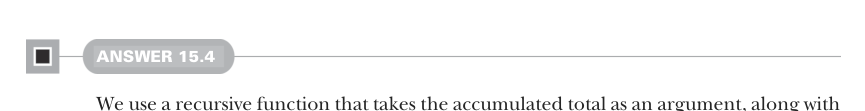
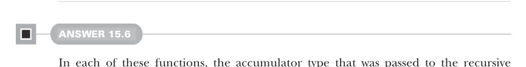

# Страница 0475
[<- Страница 0474](./page-0474) | [Указатель страниц](./) | [Страница 0476 ->](./page-0476)

> Часть 4: Эффекты и I/O / Глава 15: Обработка потоков и инкрементальный I/O / Ответы на упражнения 15.6



#### ОТВЕТ 15.4

Классический рекурсивный драйвер, пацаны: функция хапает накопленный тотал аргументом плюс следующий pull, как голодный волк после дедлайна. Uncons'им голову из pull'а, лепим её к тоталу — бац, новый счётчик! Эммитим его и ныряем рекурсией глубже, пасуя свежий тотал и хвост от uncons'а. А если pull иссяк, как кофе-машина в понедельник утром, просто возвращаем исходный Pull.Result, без соплей:

```scala
def tally[O2 >: O](using m: Monoid[O2]): Pull[O2, R] =
def go(total: O2, p: Pull[O, R]): Pull[O2, R] =
p.uncons.flatMap:
case Left(r) => Result(r)
case Right((hd, tl)) =>
val newTotal = m.combine(total, hd)
Output(newTotal) >> go(newTotal, tl)
Output(m.empty) >> go(m.empty, this)
```


#### ОТВЕТ 15.5

Тот же трюк, что с ``tally`` из прошлого экза: рекурсор жрёт текущий стейт (immutable Queue[Int], чтоб не мутировать, как в imperative аду) и следующий pull. Uncons'им голову, допихиваем в очередь, но следим, чтоб не раздулась за лимит — дропаем старую хрень с головы, как ненужные логи из продлога. Считаем матожидание по всей очереди (среднее арифметическое, чтоб data-аналитики не ныли), эммитим и рекурсим на хвосте, как бесконечный цикл оптимизаций:

```scala
extension [R](self: Pull[Int, R])
def slidingMean(n: Int): Pull[Double, R] =
def go(
window: collection.immutable.Queue[Int],
p: Pull[Int, R]
): Pull[Double, R] =
p.uncons.flatMap:
case Left(r) => Result(r)
case Right((hd, tl)) =>
val newWindow = if window.size < n then window :+ hd
else window.tail :+ hd
val meanOfNewWindow = newWindow.sum / newWindow.size.toDouble
Output(meanOfNewWindow) >> go(newWindow, tl)
go(collection.immutable.Queue.empty, self)
```



#### ОТВЕТ 15.6

Во всех этих функциях аккумулятор, который мы пасовали рекурсивному драйверу (типа тотала или стейта очереди), становится типом стейта для ``mapAccumulate``. Финальный стейт приходится выкидывать в помойку, маппя по результату ``mapAccumulate``, чтоб не тащить лишний балласт, как legacy-код из 2010-го:

[<- Страница 0474](./page-0474) | [Указатель страниц](./) | [Страница 0476 ->](./page-0476)
