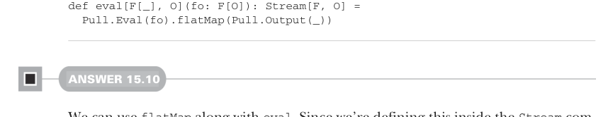
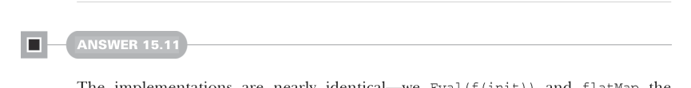

# Страница 0478

[<- Страница 0477](./page-0477) | [Индекс страниц](./) | [Страница 0479 ->](./page-0479)

> Часть 4: Эффекты и I/O / Глава 15: Обработка потоков и инкрементальный I/O / 15.6 Ответы на упражнения

## 449 15.6 Ответы на упражнения

```scala
.fold(()): (_, a) =>
writer.write(a.toString)
writer.newLine()
finally writer.close()
finally source.close()
```


#### ОТВЕТ 15.9

Мы юзаем `Pull.Eval`, чтоб слепить `Pull[F, Nothing, O]`, а потом `flatMap` на этом с `Pull.Output` — и вуаля, выходит `Pull[F, O, Unit]`, что один в один как `Stream[F, O]`, чистый FP-мистицизм в действии:



```scala
def eval[F[_], O](fo: F[O]): Stream[F, O] =
Pull.Eval(fo).flatMap(Pull.Output(_))
```

#### ОТВЕТ 15.10

Юзаем `flatMap` в паре с `eval`. Поскольку лепим это внутри компаньона `Stream`, а `Stream` — это opaque-тип над `Pull`, приходится аккуратно тыкать именно в `Stream.flatMap`, а не в метод `flatMap` на `Pull` — классический подвох с типами, через который все мы проходили, блядь:

```scala
extension [F[_], O](self: Stream[F, O])
def mapEval[O2](f: O => F[O2]): Stream[F, O2] =
Stream.flatMap(self)(o => Stream.eval(f(o)))
```



#### ОТВЕТ 15.11

Имплементации — почти клоны, один хуй: `Eval(f(init))` и `flatMap` результат — либо тормозим, если сигналит конец (как мемный кот, который 'all done'), либо эмить элемент в мир и рекурсим с обновлённым стейтом, чтоб не потерять нить:

```scala
object Pull:
def unfoldEval[F[_], O, R](init: R)(f: R =>
F[Either[R, (O, R)]]): Pull[F, O, R] =
Pull.Eval(f(init)).flatMap:
case Left(r) => Result(r)
case Right((o, r2)) => Output(o) >> unfoldEval(r2)(f)
object Stream:
def unfoldEval[F[_], O, R](init: R)(f: R =>
F[Option[(O, R)]]): Stream[F, O] =
Pull.Eval(f(init)).flatMap:
case None => Stream.empty
case Some((o, r)) => Pull.Output(o) ++ unfoldEval(r)(f)
```

[<- Страница 0477](./page-0477) | [Индекс страниц](./) | [Страница 0479 ->](./page-0479)
