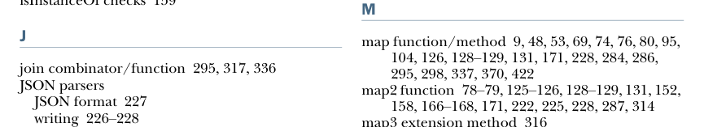
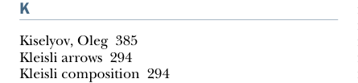

# Страница 0483
[<- Страница 0482](./page-0482) | [Индекс страниц](./) | [Страница 0484 ->](./page-0484)

> индекс / M

ИНДЕКС **454**

L

I/O (ввод/вывод) *(продолжение)* инкрементальный 411–442 более нюансированный тип I/O 368–377 свободные монады 370–371 монада только для консольного I/O 371–375 чистые интерпретаторы 375–377 неблокирующий и асинхронный I/O 377–382 простой тип IO 357–363 плюсы и минусы простого типа IO 362–363 обработка эффектов ввода 358–362 почему тип IO не тянет стриминговый I/O 386–388 тип Id 299–300 нейтральный элемент 159, 256, 294 законы идентичности 294–296 монада идентичности 297–298 выражения if 17 императивное программирование 129–132, 355 императивная оболочка 357 нечистые функции 18, 357 нечистая программа 4 приложения инкрементального I/O 442–443 расширяемые pull'ы и стримы 424–442 динамическое выделение ресурсов 441–442 стриминговые вычисления с эффектами 430–431 гарантия безопасности ресурсов 435–441 обработка ошибок 431–435 проблемы императивного I/O 411–413 простые трансформации стримов 414–423 композиция 421–423 создание pull'ов 415–421 обработка файлов 423 бесконечные ленивые списки 104–108 начальные кодировки 385 ввод/вывод. *См.* I/O конструктор типа IntState 298 тип IO[Unit] 386 проверки isInstanceOf 159

маркировка парсеров 236–237 законы 179 законы аппликатива 325–329 законы функтора 285–286 закон форкинга 160–161 закон маппинга 159–160 законы монады 291 законы моноида 256 ленивость 95 ленивый I/O 388, 413 ключевое слово lazy 98 ленивые списки 98–101 аппликативный функтор для них 320–321 хелперы для инспекции 100–101 бесконечные 104–108 тип LazyList 99 функция lazyUnit 151–152 левая идентичность 295, 326 линейный конгруэнтный генератор 120 тип данных List 35–36, 38, 40–41, 94, 99–100, 284–286 монада List 301 списки 47–49 свёртка с моноидами 258–259 в стандартной библиотеке 49 ленивые 98–101 аппликативный функтор для 320–321 бесконечные 104–108 мемоизация и избежание перевычислений 99–100 потеря эффективности 49–50 рекурсия по спискам 43–47 литеральный синтаксис 37 литералы 40 команда :load в REPL 20 локальные эффекты 388 логические нити 147 циклы в функциональном стиле 21–23

M

J

функция/метод map 9, 48, 53, 69, 74, 76, 80, 95, 104, 126, 128–129, 131, 171, 228, 284, 286, 295, 298, 337, 370, 422 функция map2 78–79, 125–126, 128–129, 131, 152, 158, 166–168, 171, 222, 225, 228, 287, 314 метод расширения map3 316 ключевое слово match 38 объект math 76 функция max 71, 192 функция mean 70–71 члены 20 мемоизация ленивых списков 99–100

комбинатор/функция join 295, 317, 336 парсеры JSON формат JSON 227 написание 226–228

K

Киселёв, Олег 385 стрелки Кляйсли 294 композиция Кляйсли 294

[<- Страница 0482](./page-0482) | [Индекс страниц](./) | [Страница 0484 ->](./page-0484)
