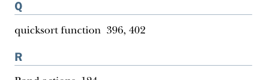

# Страница 0485

[<- Страница 0484](./page-0484) | [Индекс страниц](./) | [Страница 0486 ->](./page-0486)

> индекс / R

ИНДЕКС **456**

Pull type Pull monad 419–421 pulls creating 415–421 extensible 424–442 dynamic resource allocation 441–442 effectful streaming computations 430–431 ensuring resource safety 435–441 error handling 431–435 Pull monad 419–421 pure functions 3, 10–11, 357, 395 pure interpreters 375–377 purely algebraic structures 255 purely functional in-place quicksort 404 purely functional mutable state 395–396 purely functional parallelism algebra 158–168 fully non-blocking Par implementation using actors 163–168 law of forking 160–161 law of mapping 159–160 subtle bug 161–163 choosing data types and functions 144–152 combining parallel computations 148–150 data type for parallel computations 146–148 explicit forking 150–152 picking representation 152–158 refining combinators to their most general form 168–171 purely functional state API for state actions 124–127 combining state actions 125–126 nesting state actions 126–127 general state action data type 128–129 imperative programming 129–132 making stateful APIs pure 122–124 random number generation purely functional 120–121 using side effects 118–120 pureMain program 386 purity 11–13

parser combinators algebra designing 215–220 implementing 233–239 possible algebra 220–224 slicing and nonempty repetition 222–224 context sensitivity 225–226 error reporting 228–233 controlling branching and backtracking 232–233 error nesting 230–231 possible design 229–230 JSON parsers JSON format 227 overview of 226–228 parser generator libraries 215 Parser type 216, 227, 266, 284, 287, 318 monad instance 318–319 partial application 28 pattern matching 37–40 persistent 41 Pipe type 430 polymorphic functions 16, 372 calling higher-order functions with anonymous functions 26–27 example of 25–26 primitive combinator 151 primitive operations 186 println side effect 357, 406 procedures 18 product function 37–38 Prop combinators 196 Prop implementations 221 Prop type 184, 195 Prop.forAll function 180, 183 properties 179 property-based testing choosing data types and functions 182 generators that depend on generated values 187–188 initial snippets of an API 183–184 laws of generators 200 meaning and API of generators 186–187 meaning and API of properties 184–186 overview of 180–190 refining Prop data type 188–190 test case minimization 190–199 simple examples 192–194 using the library and improving its usability 192 writing test suite for parallel computations 194–199 testing higher-order functions and future directions 199–200 Pull data type 414–415, 421, 424

Q

quicksort function 396, 402

R

Rand actions 124 Rand[Int] function 126 random number generation 118 purely functional 120–121 using side effects 118–120 Random Number Generator (RNG) 186

[<- Страница 0484](./page-0484) | [Индекс страниц](./) | [Страница 0486 ->](./page-0486)
